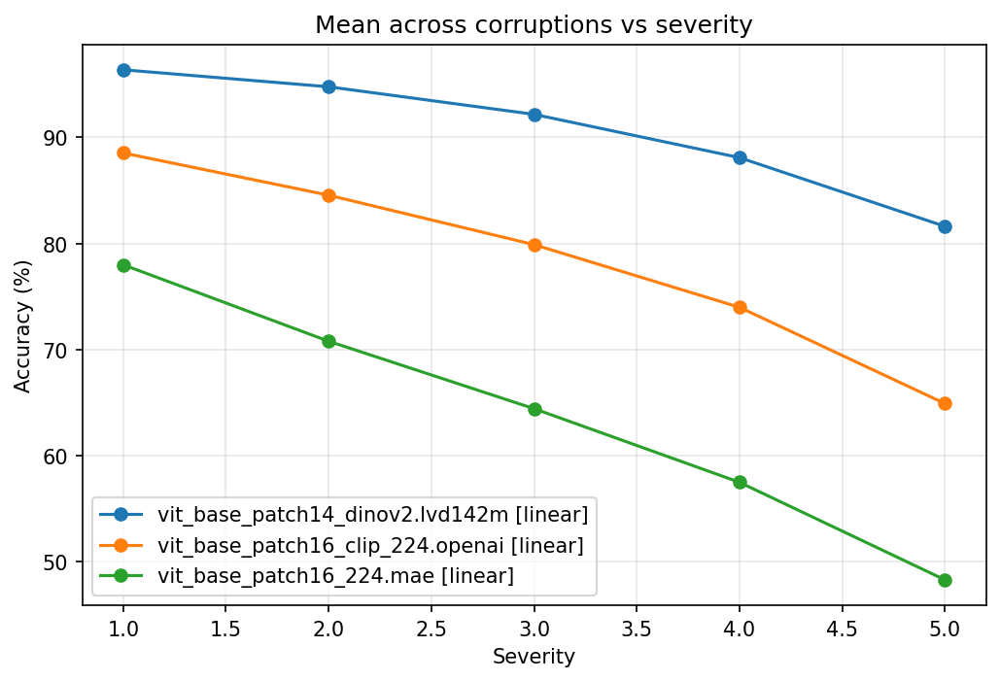
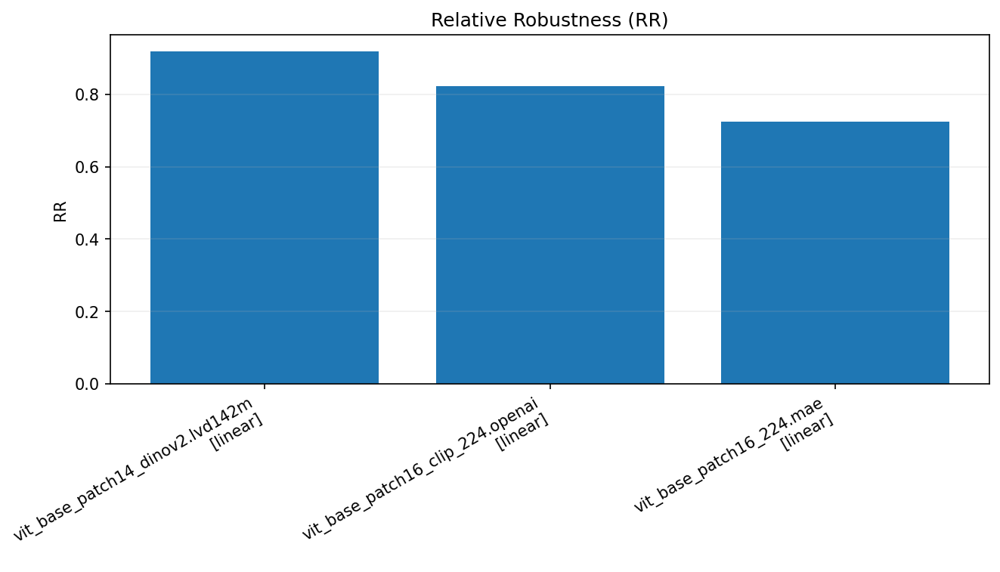
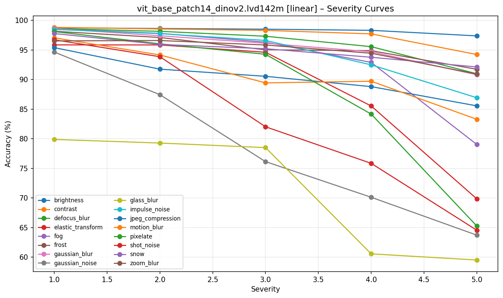

# DINOv2 vs CLIP vs MAE: Robustness Benchmark (CIFAR-10/10-C)

Benchmarking frozen visual representations from DINOv2, OpenAI CLIP, and MAE on clean CIFAR-10 and under CIFAR-10-C corruptions using linear and k-NN probes.

---

## Abstract
We benchmark the robustness of frozen ViT embeddings from self-supervised (DINOv2, MAE) and contrastive (OpenAI CLIP) models on CIFAR-10 and CIFAR-10-C. Using training-free k-NN and a linear probe, we measure clean accuracy, mean corruption accuracy (mCA), relative robustness (RR), and severity AUC. DINOv2 consistently achieves the strongest clean and corrupted performance; CLIP is competitive but less robust to noise/blur; MAE lags in both k-NN and robustness, improving with a linear head.

### Models
| Model | Source | SSL Objective | Backbone |
|--------|--------|---------------|-----------|
| DINOv2 | Meta AI | Self-distillation | ViT-B/14 |
| CLIP | OpenAI | Contrastive (image–text) | ViT-B/16 |
| MAE | Meta AI | Masked reconstruction | ViT-B/16 |

## Motivation
- Understand how different SSL objectives translate to robustness under distribution shift.
- Compare a training-free probe (k-NN) with a simple linear probe on top of frozen features.
- Provide a lightweight, reproducible pipeline with standardized metrics and plots.

### Research Questions
We aim to answer:
1. Do self-supervised ViT representations remain robust under corruptions?
2. How do contrastive vs distillation vs reconstruction objectives differ?
3. Does a training-free probe (k-NN) produce the same ranking as linear?

## Key results

### Clean CIFAR-10 (Top-1, %)
| Model | Backbone | k-NN | Linear |
|-------|----------|------|--------|
| DINOv2 | ViT-B/14 | 98.73 | 98.78 |
| CLIP | ViT-B/16 | 92.98 | 95.44 |
| MAE | ViT-B/16 | 52.92 | 88.14 |

### Robustness on CIFAR-10-C (higher is better)
Linear probe
| Model | Clean | CIFAR-10-C | RR | mCA |
|-------|-------|------------|----|-----|
| DINOv2 | 98.78 | 90.61 | 0.917 | 90.61 |
| CLIP | 95.44 | 78.38 | 0.821 | 78.38 |
| MAE | 88.14 | 63.81 | 0.724 | 63.81 |

k-NN probe (k=20)
| Model | Clean | CIFAR-10-C | RR | mCA |
|-------|-------|------------|----|-----|
| DINOv2 | 98.81 | 89.15 | 0.902 | 89.16 |
| CLIP | 92.95 | 69.37 | 0.746 | 69.37 |
| MAE | 51.91 | 36.53 | 0.704 | 36.53 |

> RR = Acc_corrupted / Acc_clean. See per-corruption and severity curves below.

## Visuals

- Cross-model mean accuracy vs severity:



- Cross-model Relative Robustness (linear):



- Example per-model severity curves (DINOv2, linear):



---

## Pipeline

```text
Images → Pretrained encoder (frozen) → Embeddings → Linear probe + k-NN → Robustness evaluation
```

## Quick start
- One-shot run for all three models (features, probes, robustness, plots):
```bash
bash run_all.sh
```
Outputs:
- Features: `features/<model>/`
- Clean summaries: `experiments/<model>/{results_linear.json, results_knn.json}`
- Robustness: `results/corrupted/<model>_{linear,knn}_robustness.json`
- Plots: `results/plots/` and `results/plots_compare/{linear,knn}/`

<details>
  <summary>Full commands (manual)</summary>

Extract features (clean):

```bash
python src/extract_features.py \
  --model vit_base_patch14_dinov2.lvd142m \
  --dataset cifar10 \
  --data_root ./data \
  --out_dir ./features \
  --batch_size 256 --num_workers 4
```

Extract features (CIFAR-10-C):

```bash
python src/extract_features.py \
  --model vit_base_patch14_dinov2.lvd142m \
  --dataset cifar10c \
  --data_root ./data \
  --out_dir ./features \
  --batch_size 256 --num_workers 4
```

Train linear probe:

```bash
python src/train_linear.py \
  --model vit_base_patch14_dinov2.lvd142m \
  --in_dir ./features --out_dir ./experiments \
  --scale --refit_on_full --Cs 0.1 1.0 10.0
```

Run k-NN (clean + CIFAR-10-C saved in JSON):

```bash
python src/eval_knn.py \
  --model vit_base_patch14_dinov2.lvd142m \
  --in_dir ./features --out_dir ./experiments \
  --normalize --use_val_db --k 1 5 20
```

Evaluate robustness on CIFAR-10-C:

```bash
# Linear
python src/eval_corruptions.py \
  --model vit_base_patch14_dinov2.lvd142m \
  --in_dir ./features --out_dir ./results \
  --probe linear \
  --clean_metrics experiments/vit_base_patch14_dinov2.lvd142m/results_linear.json \
  --clf_path experiments/vit_base_patch14_dinov2.lvd142m/linear_clf.joblib

# k-NN
python src/eval_corruptions.py \
  --model vit_base_patch14_dinov2.lvd142m \
  --in_dir ./features --out_dir ./results \
  --probe knn --k 20 --metric cosine --normalize --use_val_db \
  --clean_metrics experiments/vit_base_patch14_dinov2.lvd142m/results_knn.json
```

Per-model plots:

```bash
python src/plotting.py \
  --results results/corrupted/vit_base_patch14_dinov2.lvd142m_linear_robustness.json \
            results/corrupted/vit_base_patch14_dinov2.lvd142m_knn_robustness.json \
  --out_dir results/plots
```

Cross-model plots:

```bash
python src/plot_compare.py \
  --results \
    results/corrupted/vit_base_patch14_dinov2.lvd142m_linear_robustness.json \
    results/corrupted/vit_base_patch16_clip_224.openai_linear_robustness.json \
    results/corrupted/vit_base_patch16_224.mae_linear_robustness.json \
  --out_dir results/plots_compare/linear
```

</details>

---

## Environment and hardware
- Python: see `requirements.txt` (you might need to install PyTorch/torchvision per your CUDA setup).
- GPU highly recommended. Batch size 256 fits should fit commonly available 12 GB GPUs; reduce if OOM.
- Mixed precision is enabled by default in feature extraction; disable via `--no_amp`.
- Performance note: DINOv2 (ViT-B/14) feature extraction is noticeably slower than CLIP or MAE on the same hardware.

---

## Methods and metrics
- Probes: k-NN (cosine, k ∈ {1,5,20}, optionally L2-normalized, uses train+val DB) and logistic regression linear probe (with scaling, simple C-search).
- Metrics: Top-1 (clean and CIFAR-10-C), Mean Corruption Accuracy (mCA), Relative Robustness (RR), and Severity AUC. See `src/metrics.py`.

---

## Conclusion
- **DINOv2** learns the most robust and linearly separable features.
- **CLIP** performs well on clean data but is **less robust to corruptions**, especially noise.
- **MAE** struggles under distribution shift due to its reconstruction objective.
- **Self-distillation > contrastive > reconstruction** for robustness in ViT embeddings.

## Future Work
- Add **iBOT** and **MaskFeat** for stronger SSL comparison
- Evaluate **domain shift** (ImageNet → CIFAR-10/Food101)
- Add **adversarial robustness** with AutoAttack
- Extend benchmark to **ViT-L and ViT-H** scales

---

## Reproducibility
- Fixed CIFAR-10 split (seed 42, 5k-val) stored under `data/cifar10_splits/`.
- Transforms are resolved per model with `timm` to match pretraining configs.
- All metrics and predictions are saved in `experiments/` and `results/` JSONs.

---

## Citation
If you use this codebase, please cite the original model papers and this repository.

- DINOv2: Oquab et al., 2023
- CLIP: Radford et al., 2021
- MAE: He et al., 2022

---

## License
MIT License (see `LICENSE`).


